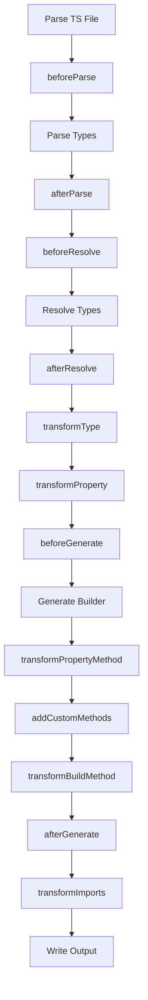

# Plugin System

The plugin system allows you to extend fluent-gen-ts with custom functionality,
validation, transformations, and custom methods.

## Plugin Basics

A plugin is a JavaScript/TypeScript module that exports an object implementing
the `Plugin` interface:

```typescript
interface Plugin {
  readonly name: string;
  readonly version: string;
  readonly imports?: PluginImports;

  // Lifecycle hooks (all optional)
  beforeParse?: (context: ParseContext) => Result<ParseContext>;
  afterParse?: (context: ParseContext, type: Type) => Result<Type>;
  beforeResolve?: (context: ResolveContext) => Result<ResolveContext>;
  afterResolve?: (
    context: ResolveContext,
    typeInfo: TypeInfo,
  ) => Result<TypeInfo>;
  beforeGenerate?: (context: GenerateContext) => Result<GenerateContext>;
  afterGenerate?: (code: string, context: GenerateContext) => Result<string>;

  // Transformation hooks
  transformType?: (type: Type, typeInfo: TypeInfo) => Result<TypeInfo>;
  transformProperty?: (property: PropertyInfo) => Result<PropertyInfo>;
  transformBuildMethod?: (context: BuildMethodContext) => Result<string>;
  transformPropertyMethod?: (
    context: PropertyMethodContext,
  ) => Result<PropertyMethodTransform>;
  transformValue?: (context: ValueContext) => Result<ValueTransform | null>;
  transformImports?: (
    context: ImportTransformContext,
  ) => Result<ImportTransformContext>;

  // Extension hooks
  addCustomMethods?: (
    context: BuilderContext,
  ) => Result<readonly CustomMethod[]>;
}
```

## Plugin Lifecycle

Plugins hook into various stages of the generation process:



## Simple Plugin Example

Here's a basic validation plugin:

```typescript
// validation-plugin.js
import { ok } from 'fluent-gen-ts';

export default {
  name: 'validation-plugin',
  version: '1.0.0',

  transformPropertyMethod(context) {
    const { property } = context;

    // Add email validation
    if (property.name === 'email') {
      return ok({
        validate: `
    if (value && !value.includes('@')) {
      throw new Error('Invalid email format');
    }`,
      });
    }

    // Add age validation
    if (property.name === 'age') {
      return ok({
        validate: `
    if (value !== undefined && (value < 0 || value > 150)) {
      throw new Error('Age must be between 0 and 150');
    }`,
      });
    }

    return ok({});
  },
};
```

Usage:

```javascript
// fluent.config.js
export default {
  plugins: ['./validation-plugin.js'],
  // ... other config
};
```

## Plugin Hook Reference

### Lifecycle Hooks

#### `beforeParse`

Called before parsing the TypeScript file.

```typescript
beforeParse(context: ParseContext): Result<ParseContext>

interface ParseContext {
  readonly sourceFile: string;
  readonly typeName: string;
}
```

#### `afterParse`

Called after parsing, receives the parsed Type.

```typescript
afterParse(context: ParseContext, type: Type): Result<Type>
```

#### `beforeResolve` / `afterResolve`

Called before/after type resolution.

```typescript
beforeResolve(context: ResolveContext): Result<ResolveContext>
afterResolve(context: ResolveContext, typeInfo: TypeInfo): Result<TypeInfo>

interface ResolveContext {
  readonly type: Type;
  readonly symbol?: Symbol;
  readonly sourceFile?: string;
  readonly typeName?: string;
}
```

#### `beforeGenerate` / `afterGenerate`

Called before/after code generation.

```typescript
beforeGenerate(context: GenerateContext): Result<GenerateContext>
afterGenerate(code: string, context: GenerateContext): Result<string>

interface GenerateContext {
  readonly resolvedType: ResolvedType;
  readonly options: Record<string, unknown>;
}
```

### Transformation Hooks

#### `transformType`

Transform the resolved type information.

```typescript
transformType(type: Type, typeInfo: TypeInfo): Result<TypeInfo>
```

#### `transformProperty`

Transform individual property information.

```typescript
transformProperty(property: PropertyInfo): Result<PropertyInfo>

interface PropertyInfo {
  name: string;
  type: TypeInfo;
  isOptional: boolean;
  jsDoc?: string;
}
```

#### `transformPropertyMethod`

Customize how property methods are generated.

```typescript
transformPropertyMethod(context: PropertyMethodContext): Result<PropertyMethodTransform>

interface PropertyMethodContext {
  readonly property: PropertyInfo;
  readonly propertyType: TypeInfo;
  readonly builderName: string;
  readonly typeName: string;

  // Helper methods
  isType(kind: TypeKind): boolean;
  isArrayType(): boolean;
  isUnionType(): boolean;
  isPrimitiveType(name?: string): boolean;
}

interface PropertyMethodTransform {
  readonly parameterType?: string;
  readonly extractValue?: string;
  readonly validate?: string;
}
```

#### `transformBuildMethod`

Customize the build method implementation.

```typescript
transformBuildMethod(context: BuildMethodContext): Result<string>

interface BuildMethodContext {
  readonly typeName: string;
  readonly builderName: string;
  readonly buildMethodCode: string;
  readonly properties: readonly PropertyInfo[];
  readonly genericParams: string;
  readonly genericConstraints: string;
}
```

#### `transformValue`

Transform property values during build.

```typescript
transformValue(context: ValueContext): Result<ValueTransform | null>

interface ValueContext {
  readonly property: string;
  readonly valueVariable: string;
  readonly type: TypeInfo;
  readonly isOptional: boolean;
}

interface ValueTransform {
  readonly condition?: string;
  readonly transform: string;
}
```

#### `transformImports`

Modify import statements in generated code.

```typescript
transformImports(context: ImportTransformContext): Result<ImportTransformContext>

interface ImportTransformContext {
  readonly imports: readonly string[];
  readonly resolvedType: ResolvedType;
  readonly isGeneratingMultiple: boolean;
  readonly hasExistingCommon: boolean;
}
```

### Extension Hooks

#### `addCustomMethods`

Add custom methods to generated builders.

```typescript
addCustomMethods(context: BuilderContext): Result<readonly CustomMethod[]>

interface BuilderContext {
  readonly typeName: string;
  readonly builderName: string;
  readonly properties: readonly PropertyInfo[];
  readonly genericParams: string;
  readonly genericConstraints: string;
}

interface CustomMethod {
  readonly name: string;
  readonly signature: string;
  readonly implementation: string;
  readonly jsDoc?: string;
}
```

## Advanced Plugin Examples

### Custom Methods Plugin

Add domain-specific methods to builders:

```typescript
// custom-methods-plugin.js
import { ok } from 'fluent-gen-ts';

export default {
  name: 'custom-methods-plugin',
  version: '1.0.0',

  addCustomMethods(context) {
    const methods = [];

    // Add pricing methods for Product builders
    if (context.typeName === 'Product') {
      methods.push({
        name: 'withDiscountedPrice',
        signature:
          'withDiscountedPrice(originalPrice: number, discountPercent: number): this',
        implementation: `
  withDiscountedPrice(originalPrice: number, discountPercent: number): this {
    const discountedPrice = originalPrice * (1 - discountPercent / 100);
    return this.withPrice(discountedPrice);
  }`,
        jsDoc: `/**
   * Sets the price with a discount applied
   * @param originalPrice - The original price
   * @param discountPercent - The discount percentage (0-100)
   */`,
      });

      methods.push({
        name: 'withFormattedPrice',
        signature:
          'withFormattedPrice(price: number, currency: string = "USD"): this',
        implementation: `
  withFormattedPrice(price: number, currency: string = "USD"): this {
    const formatted = new Intl.NumberFormat('en-US', {
      style: 'currency',
      currency
    }).format(price);
    return this.withPrice(price).withDisplayPrice(formatted);
  }`,
        jsDoc: `/**
   * Sets price and formatted display price
   * @param price - The numeric price
   * @param currency - Currency code (default: USD)
   */`,
      });
    }

    // Add utility methods for User builders
    if (context.typeName === 'User') {
      methods.push({
        name: 'withRandomId',
        signature: 'withRandomId(prefix: string = "user"): this',
        implementation: `
  withRandomId(prefix: string = "user"): this {
    const id = \`\${prefix}-\${Date.now()}-\${Math.random().toString(36).substr(2, 9)}\`;
    return this.withId(id);
  }`,
        jsDoc: `/**
   * Generates and sets a random ID
   * @param prefix - ID prefix (default: "user")
   */`,
      });

      methods.push({
        name: 'asAdmin',
        signature: 'asAdmin(): this',
        implementation: `
  asAdmin(): this {
    return this.withRole('admin').withIsActive(true);
  }`,
        jsDoc: `/**
   * Configure as admin user
   */`,
      });
    }

    return ok(methods);
  },
};
```

### Type Transformation Plugin

Transform types during resolution:

```typescript
// type-transform-plugin.js
import { ok } from 'fluent-gen-ts';

export default {
  name: 'type-transform-plugin',
  version: '1.0.0',

  transformProperty(property) {
    // Convert Date strings to Date objects
    if (
      property.type.name === 'string' &&
      (property.name.includes('Date') || property.name.includes('Time'))
    ) {
      return ok({
        ...property,
        type: {
          ...property.type,
          name: 'Date',
        },
      });
    }

    // Add validation constraints
    if (property.name === 'email') {
      return ok({
        ...property,
        jsDoc: `${property.jsDoc || ''}\n@pattern email format required`,
      });
    }

    return ok(property);
  },

  transformValue(context) {
    // Transform string dates to Date objects
    if (context.type.name === 'Date' && context.property.includes('Date')) {
      return ok({
        condition: `typeof ${context.valueVariable} === 'string'`,
        transform: `new Date(${context.valueVariable})`,
      });
    }

    return ok(null);
  },
};
```

### Import Transformation Plugin

Modify imports in generated code:

```typescript
// import-transform-plugin.js
import { ok } from 'fluent-gen-ts';

export default {
  name: 'import-transform-plugin',
  version: '1.0.0',

  imports: {
    runtime: ['dayjs'], // Add dayjs as runtime dependency
    types: ['Moment'], // Add Moment as type import
  },

  transformImports(context) {
    const customImports = [
      ...context.imports,
      'import dayjs from "dayjs";',
      'import type { Moment } from "moment";',
    ];

    return ok({
      ...context,
      imports: customImports,
    });
  },

  addCustomMethods(context) {
    if (context.properties.some(p => p.type.name === 'Date')) {
      return ok([
        {
          name: 'withCurrentTimestamp',
          signature: 'withCurrentTimestamp(): this',
          implementation: `
  withCurrentTimestamp(): this {
    return this.withCreatedAt(dayjs().toDate());
  }`,
          jsDoc: `/**
   * Sets createdAt to current timestamp using dayjs
   */`,
        },
      ]);
    }

    return ok([]);
  },
};
```

### Build Method Transformation Plugin

Customize the build method:

```typescript
// build-transform-plugin.js
import { ok } from 'fluent-gen-ts';

export default {
  name: 'build-transform-plugin',
  version: '1.0.0',

  transformBuildMethod(context) {
    // Add automatic timestamp for entities with createdAt
    if (context.properties.some(p => p.name === 'createdAt')) {
      const customBuildMethod = `
  build(context?: BaseBuildContext): ${context.typeName} {
    // Auto-set createdAt if not provided
    if (!this.has('createdAt')) {
      this.set('createdAt', new Date());
    }

    // Auto-set updatedAt
    if (this.has('updatedAt') && !this.peek('updatedAt')) {
      this.set('updatedAt', new Date());
    }

    ${context.buildMethodCode.replace('build(context?: BaseBuildContext): ', '')}
  }`;

      return ok(customBuildMethod);
    }

    return ok(context.buildMethodCode);
  },
};
```

## Plugin Context Helpers

The `PropertyMethodContext` provides helpful methods:

```typescript
// Example plugin using context helpers
export default {
  name: 'conditional-plugin',
  version: '1.0.0',

  transformPropertyMethod(context) {
    const { property } = context;

    // Check type kinds
    if (context.isType('string') && context.property.name.endsWith('Url')) {
      return ok({
        validate: `
    if (value && !value.startsWith('http')) {
      throw new Error('URL must start with http');
    }`,
      });
    }

    // Handle arrays differently
    if (context.isArrayType()) {
      return ok({
        validate: `
    if (value && !Array.isArray(value)) {
      throw new Error('${property.name} must be an array');
    }`,
      });
    }

    // Handle union types
    if (context.isUnionType()) {
      return ok({
        validate: `
    const validValues = ${JSON.stringify(context.propertyType.unionTypes)};
    if (value && !validValues.includes(value)) {
      throw new Error('Invalid value for ${property.name}');
    }`,
      });
    }

    return ok({});
  },
};
```

## Using Plugins

### In Configuration File

```javascript
// fluent.config.js
export default {
  plugins: [
    './plugins/validation.js',
    './plugins/custom-methods.js',
    './node_modules/fluent-gen-plugin-timestamps/index.js',
  ],
  // ... other config
};
```

### Programmatically

```typescript
import { FluentGen, PluginManager } from 'fluent-gen-ts';
import validationPlugin from './plugins/validation.js';
import customMethodsPlugin from './plugins/custom-methods.js';

const pluginManager = new PluginManager();
pluginManager.register(validationPlugin);
pluginManager.register(customMethodsPlugin);

const gen = new FluentGen({ pluginManager });
```

## Plugin Development Tips

### Use Result Type

Always return `Result<T>` instead of throwing:

```typescript
// ✅ Good
transformProperty(property) {
  if (property.name === 'invalid') {
    return err(new Error('Invalid property name'));
  }
  return ok(property);
}

// ❌ Bad
transformProperty(property) {
  if (property.name === 'invalid') {
    throw new Error('Invalid property name');
  }
  return property;
}
```

### Handle Edge Cases

```typescript
transformPropertyMethod(context) {
  // Check if property exists
  if (!context.property) {
    return ok({});
  }

  // Handle complex types gracefully
  try {
    const transform = generateTransform(context);
    return ok(transform);
  } catch (error) {
    return err(new Error(`Transform failed: ${error.message}`));
  }
}
```

### Test Your Plugins

Create test files for your plugins:

```typescript
// test/validation-plugin.test.ts
import { describe, it, expect } from 'vitest';
import validationPlugin from '../plugins/validation.js';

describe('ValidationPlugin', () => {
  it('should add email validation', () => {
    const context = {
      property: { name: 'email', type: { name: 'string' } },
      // ... other context
    };

    const result = validationPlugin.transformPropertyMethod(context);

    expect(result.ok).toBe(true);
    expect(result.value.validate).toContain('@');
  });
});
```

## Plugin Distribution

### NPM Package

Create a package for reusable plugins:

```json
{
  "name": "fluent-gen-plugin-validation",
  "version": "1.0.0",
  "main": "dist/index.js",
  "types": "dist/index.d.ts",
  "peerDependencies": {
    "fluent-gen-ts": "^0.0.1"
  }
}
```

### Plugin Template

```typescript
// src/index.ts
import type { Plugin } from 'fluent-gen-ts';
import { ok, err } from 'fluent-gen-ts';

export interface PluginOptions {
  // Plugin configuration options
}

export function createValidationPlugin(options: PluginOptions = {}): Plugin {
  return {
    name: 'validation-plugin',
    version: '1.0.0',

    transformPropertyMethod(context) {
      // Implementation
      return ok({});
    },
  };
}

export default createValidationPlugin();
```

## Next Steps

- See [Advanced Usage](./advanced-usage.md) for complex scenarios
- Check [Examples](/examples/) for real-world plugin usage
- Browse the [API Reference](/api/reference) for detailed interfaces
- Look at the [CLI Commands](./cli-commands.md) for plugin configuration
