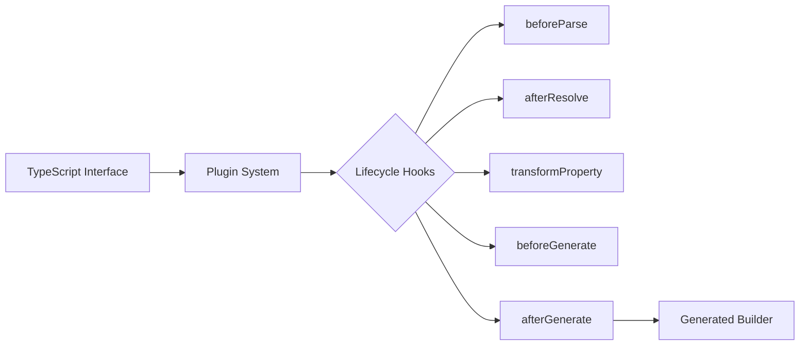

# Plugin System Overview

<!-- prettier-ignore -->
::: tip What You'll Learn

- What plugins are and when to use them
- Plugin capabilities and architecture
- How to choose between manual builders and plugins
- Quick decision guide for plugin features
  :::

## What Are Plugins?

Plugins extend fluent-gen-ts to customize how builders are generated. Instead of
manually extending generated builders, plugins transform them **during
generation** with powerful, reusable logic.

### Why Use Plugins?

**Without Plugins:**

```typescript
// Manual approach - repetitive and error-prone
class UserBuilder extends GeneratedUserBuilder {
  withValidatedEmail(email: string): this {
    if (!isEmail(email)) throw new Error('Invalid email');
    return this.withEmail(email);
  }

  withRandomId(): this {
    return this.withId(`user-${Date.now()}`);
  }
}
```

**With Plugins:**

```typescript
// Plugin approach - automatic, reusable, type-safe
const validationPlugin = createPlugin('validation', '1.0.0')
  .transformPropertyMethods(builder =>
    builder
      .when(ctx => ctx.property.name === 'email')
      .setValidator('if (!isEmail(value)) throw new Error("Invalid email")')
      .done(),
  )
  .addMethod(method =>
    method
      .name('withRandomId')
      .returns('this')
      .implementation('return this.withId(`user-${Date.now()}`)'),
  )
  .build();

// All builders automatically get validation + custom methods!
```

## When to Use Plugins

### ✅ Use Plugins For:

- **Validation** - Email, URL, phone number validation across all builders
- **Transformation** - Convert strings to dates, normalize data
- **Custom Methods** - Add domain-specific methods (`.asAdmin()`,
  `.withFakeData()`)
- **Import Management** - Automatically add required dependencies
- **Type Enhancement** - Transform parameter types (e.g.,
  `string | TaggedValue<string>`)
- **Build Hooks** - Insert logic before/after object creation
- **Naming Strategies** - Custom filename generation rules
- **Testing Utilities** - Add `.buildMany()`, `.withTestData()` methods

### ❌ Don't Use Plugins For:

- **One-off customization** - Just extend the builder manually
- **Runtime behavior** - Plugins work at **generation time** only
- **Simple property defaults** - Use the builder's initial values instead

## Quick Decision Guide

**"I want to..."**

| Goal                                       | Use This                                                                      |
| ------------------------------------------ | ----------------------------------------------------------------------------- |
| Validate email fields automatically        | [Cookbook - Validation](/guide/plugins/cookbook#validation)                   |
| Add custom methods to all builders         | [Cookbook - Custom Methods](/guide/plugins/cookbook#custom-methods)           |
| Transform types deeply (e.g., all strings) | [Best Practices - Rule Ordering](/guide/plugins/best-practices#rule-ordering) |
| Add external dependencies                  | [Cookbook - Examples](/guide/plugins/cookbook)                                |
| Create test data helpers                   | [Cookbook - Testing Plugin](/guide/plugins/cookbook#testing)                  |
| Validate before build                      | [Cookbook - Validation Plugin](/guide/plugins/cookbook#validation)            |
| Auto-generate IDs                          | [Cookbook - ID Generation](/guide/plugins/cookbook#database)                  |
| Transform API responses                    | [Cookbook - API Transform Plugin](/guide/plugins/cookbook#api)                |

## Plugin Capabilities

### 1. **Property Method Transformations**

Modify how `withProperty()` methods work:

```typescript
.transformPropertyMethods(builder => builder
  .when(ctx => ctx.property.name === 'age')
  .setParameter('number | string')  // Accept string too
  .setExtractor('Number(value)')     // Convert to number
  .setValidator('if (value < 0) throw new Error("Age must be positive")')
  .done()
)
```

### 2. **Custom Methods**

Add new methods to builders:

```typescript
.addMethod(method => method
  .name('withTimestamps')
  .returns('this')
  .implementation(`
    return this
      .withCreatedAt(new Date())
      .withUpdatedAt(new Date());
  `)
)
```

### 3. **Build Method Transformation**

Insert logic before/after build:

```typescript
.transformBuildMethod(transform => transform
  .insertBefore('return this.buildWithDefaults', `
    // Auto-generate ID if missing
    if (!this.has('id')) {
      this.set('id', generateUUID());
    }
  `)
)
```

### 4. **Import Management**

Automatically add required imports:

```typescript
.requireImports(imports => imports
  .addExternal('validator', ['isEmail', 'isURL'])
  .addInternalTypes('../types.js', ['CustomType'])
)
```

### 5. **Deep Type Transformations**

Transform types at any nesting level:

```typescript
.transformPropertyMethods(builder => builder
  .when(ctx => ctx.type.containsDeep(primitive('string')))
  .setParameter(ctx =>
    ctx.type.transformDeep()
      .replace(primitive('string'), 'string | TaggedValue<string>')
      .toString()
  )
  .done()
)
```

## Plugin Architecture



### Lifecycle Hooks

Plugins can hook into these stages:

1. **beforeParse** - Before parsing TypeScript file
2. **afterParse** - After parsing, before type resolution
3. **beforeResolve** - Before resolving the type
4. **afterResolve** - After type resolution
5. **transformProperty** - Transform individual properties
6. **beforeGenerate** - Before generating code
7. **transformPropertyMethod** - Customize property methods
8. **addCustomMethods** - Add custom methods
9. **transformBuildMethod** - Customize build method
10. **afterGenerate** - After code generation
11. **transformImports** - Modify import statements

## Creating Your First Plugin

The fastest way to start is with the
[Getting Started Guide](/guide/plugins/getting-started):

```typescript
import { createPlugin } from 'fluent-gen-ts';

const myPlugin = createPlugin('my-first-plugin', '1.0.0')
  .setDescription('My awesome plugin')

  // Add functionality here

  .build();

export default myPlugin;
```

## Common Plugin Patterns

### Validation Plugin

```typescript
const validationPlugin = createPlugin('validation', '1.0.0')
  .requireImports(imports =>
    imports.addExternal('validator', ['isEmail', 'isURL']),
  )
  .transformPropertyMethods(builder =>
    builder
      .when(ctx => ctx.property.name === 'email')
      .setValidator(
        'if (value && !isEmail(value)) throw new Error("Invalid email")',
      )
      .done()

      .when(ctx => ctx.property.name.endsWith('Url'))
      .setValidator(
        'if (value && !isURL(value)) throw new Error("Invalid URL")',
      )
      .done(),
  )
  .build();
```

### Testing Helper Plugin

```typescript
const testingPlugin = createPlugin('testing', '1.0.0')
  .requireImports(imports => imports.addExternal('faker', ['faker']))
  .addMethod(method =>
    method.name('withFakeData').returns('this').implementation(`
      return this
        .withId(faker.string.uuid())
        .withName(faker.person.fullName())
        .withEmail(faker.internet.email());
    `),
  )
  .build();
```

## Next Steps

<div class="next-steps">

### 🚀 Get Started

Start creating plugins: **[Getting Started →](/guide/plugins/getting-started)**

### 🔍 API Reference

Complete API documentation: **[API Reference →](/guide/plugins/api-reference)**

### 📖 See Examples

Browse ready-to-use plugins: **[Cookbook →](/guide/plugins/cookbook)**

### ⚡ Best Practices

Learn critical patterns: **[Best Practices →](/guide/plugins/best-practices)**

</div>

## Configuration

### Single Plugin

```javascript
// fluentgen.config.js
export default {
  plugins: ['./plugins/validation.ts'],
  targets: [{ file: './src/types.ts', types: ['User'] }],
};
```

### Multiple Plugins

```javascript
export default {
  plugins: [
    './plugins/validation.ts',
    './plugins/testing.ts',
    './plugins/database.ts',
  ],
  targets: [{ file: './src/types.ts', types: ['User', 'Product'] }],
};
```

**Note:** Plugins execute in order. Order matters when plugins modify the same
properties!

## Related Pages

- [Plugin API Reference](/guide/plugins/api-reference) - Quick API lookup
- [Advanced Usage](/guide/advanced-usage) - Complex scenarios
- [Examples](/examples/) - Real-world usage patterns
- [Configuration](/guide/configuration) - Config file setup

<style scoped>
.next-steps {
  display: grid;
  grid-template-columns: repeat(auto-fit, minmax(200px, 1fr));
  gap: 1rem;
  margin-top: 2rem;
}

.next-steps > div {
  padding: 1rem;
  border: 1px solid var(--vp-c-divider);
  border-radius: 8px;
}
</style>
